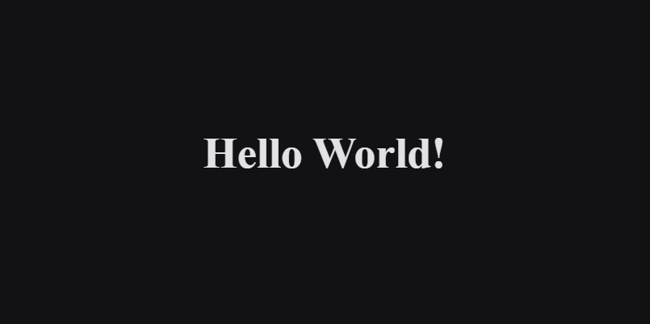

    <h1 align="center">
        Projeto ReactJS + NextJS + TypeScript
    </h1>

  <a href="#tecnologias">Tecnologias</a>&nbsp;&nbsp;&nbsp;|&nbsp;&nbsp;&nbsp;
  <a href="#projeto">Projeto</a>&nbsp;&nbsp;&nbsp;|&nbsp;&nbsp;&nbsp;
  <a href="#layout">Layout</a>

## 🚀 Tecnologias

Esse projeto foi desenvolvido com as seguintes tecnologias:
- [ReactJS](https://reactjs.org)
- [NextJS](https://nextjs.org)
- [TypeScript](https://www.typescriptlang.org)
- [Styled-Components](https://styled-components.com)
- [ESLint](https://eslint.org)
- [Prettier](https://prettier.io)

## 💻 Projeto

Essa é uma estrutura inicial para qualquer projeto utilizando ReactJS + NextJS.
Um bom atalho para não precisar configurar todos os projetos do zero.

Ja esta configurado:
    NextJS + TypeScript
    NextJS + StyledComponent
    ESLint VSCode
    Prettier VSCode

Esta configurado tambem o arquivo _documento do NextJS

## Layout

    

